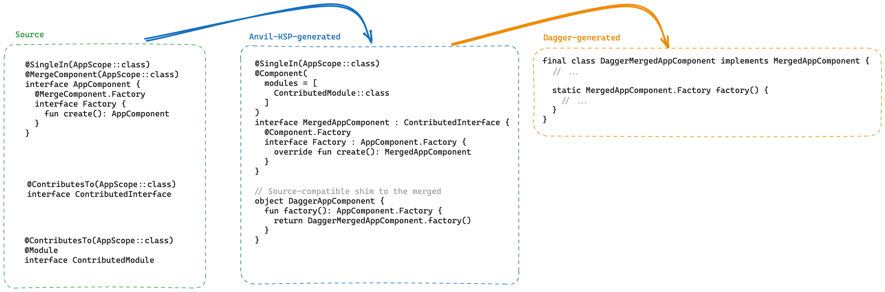
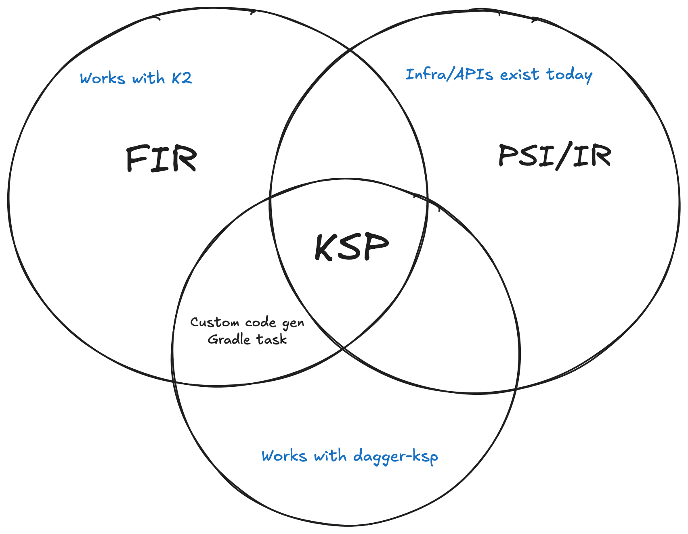

Fork Instructions
=================

This repo is a fork of Anvil that seeks to complete KSP support. At the point of divergence,
Anvil supported KSP contributions and factories, but not yet merging contributions or
contributing subcomponents.

## Blockers

Before trying to use KSP component merging, check this issue to see if any of the issues
listed there affect you: https://github.com/ZacSweers/anvil/issues/16. KSP1 is fully supported, KSP2 may have upstream blockers while it's in beta.

## Installation

This fork is published on Maven Central under the group ID `dev.zacsweers.anvil` and Gradle Plugin 
ID `dev.zacsweers.anvil`. To consume it, replace your existing Anvil dependencies with the following:

| Before                                    | After                                      |
|-------------------------------------------|--------------------------------------------|
| `com.squareup.anvil:annotations`          | `dev.zacsweers.anvil:annotations`          |
| `com.squareup.anvil:annotations-optional` | `dev.zacsweers.anvil:annotations-optional` |
| `com.squareup.anvil:compiler`             | `dev.zacsweers.anvil:compiler`             |
| `com.squareup.anvil:compiler-api`         | `dev.zacsweers.anvil:compiler-api`         |
| `com.squareup.anvil:compiler-utils`       | `dev.zacsweers.anvil:compiler-utils`       |
| `com.squareup.anvil:gradle-plugin`        | `dev.zacsweers.anvil:gradle-plugin`        |
| `id(com.squareup.anvil)`                  | `id(dev.zacsweers.anvil)`                  |

In most cases, it should be enough to just replace the Gradle plugin ID and annotations dependencies. 
The fork's gradle plugin will automatically substitute any annotations dependencies from the upstream artifact to the fork's.

Latest version can be found here: https://github.com/ZacSweers/anvil/releases

## Features

- K2-compatible
- Full KSP support + improved error messaging
- `jakarta.inject` annotations support

## Migration

### 0. Prerequisites

- You must be using Kotlin 1.9.24+ or 2.0.0+.
- You must use `-Xjvm-default=all` or `-Xjvm-default=all-compatibility` if you are not already.
- KSP does not support Android variants, so if you rely on `variantFilter` it will no longer work.

### 1. KSP Contributions

It _should_ be possible to migrate to this fork with minimal source changes.

First, update to KSP contribution. It's better to do this first before proceeding to component
merging as it allows for incremental adoption. However, you can do both at the same time if you'd
rather. If you use `@ContributesSubcomponent` at all, you will need to do both steps 1 and 2 at the
same time as the legacy IR merger does not understand code generated by KSP subcomponent
contribution.

```kotlin
// In build.gradle
anvil {
  useKsp(
    contributesAndFactoryGeneration = true,
    componentMerging = false,
  )
}
```

This will use KSP for contributions (i.e. `@Contributes*` annotations) and factory generation.

Note that you may need to set up KAPT stub gen and KAPT to tasks to source KSP outputs for this. If
you are doing both steps at the same time, you can skip this.

Note that you also need to ensure that your kapt tasks still target Kotlin language version 1.9 for
this step as the original Anvil IR merger only works in Kotlin 1.9.

### 2. KSP Component Merging

Once you have KSP contributions working, you can enable component merging.

```kotlin
// In build.gradle
anvil {
  useKsp(
    contributesAndFactoryGeneration = true,
    componentMerging = true,
  )
}

```

Next - remove dagger-compiler from `kapt` configurations and move it to the `ksp` configuration
instead.

If this was the only bit using kapt, you can now remove kapt entirely! You can also remove
any `languageVersion` overrides forcing Kotlin 1.9.

This is where you will need to do some small source changes.

Replace any creator annotations with anvil equivalents.

| Before                  | After                        |
|-------------------------|------------------------------|
| `@Component.Factory`    | `@MergeComponent.Factory`    |
| `@Component.Builder`    | `@MergeComponent.Builder`    |
| `@Subcomponent.Factory` | `@MergeSubcomponent.Factory` |
| `@Subcomponent.Builder` | `@MergeSubcomponent.Builder` |

This is hopefully the only source change you should need to make! Anvil will generate
source-compatible shims
where necessary for everything else.

The only other source change you may need to make is if you include `@MergeInterfaces` or
`@MergeModules` in non-Anvil-processed components or modules, in which case you will need to
manually
use the generated `Merged*` classes. See the Technical Design section for more details.

You _should_ be able to build now.

## Options

This fork contains some extra KSP options that can be used for different scenarios.

- `anvil-ksp-verbose`: Enable verbose logging, such as processor timing information.
- `anvil-ksp-extraContributingAnnotations`: A colon-delimited list of additional contributing annotations to scan for. More on this below.
- `anvil-ksp-enable-contributes-subcomponent-merging`: Enable/disable scanning the classpath for `@ContributesSubcomponent` triggers. This can be useful if working in a codebase or project that doesn't use `@ContributeSubcomponent` and thus doesn't need to scan the classpath for them while merging. Default is true.

## Compatibility

### Using Anvil KSP without dagger-ksp

It _should_ be possible to use Anvil KSP and still run dagger in kapt, but you will need to ensure
KSP's output sources are wired in as inputs to the appropriate kapt tasks. If you do this, you
_should_ be able to safely use K2 KAPT now and remove `languageVersion` overrides, as Anvil will not
longer be running a compiler plugin in kapt's stub gen task.

### Using Anvil KSP with KSP2

See the Blockers section for any issues here. At the time of writing, dagger-ksp does not work in
KSP2 but you may be able use Anvil KSP with KSP2 IFF you use dagger with kapt. YMMV.

### Backward compatibility

This fork should be backward-compatible with code generated from Anvil 2.5.0-beta09. However, it's
not well-tested and encouraged to recompile all Anvil-processed code after migrating to this fork.
Especially if you use `@ContributesSubcomponent` or `@MergeComponent`, as the generated code for
these scenarios has changed the most in the move to KSP.

### Custom Code Generators

If you previously implemented any custom `CodeGenerator`s from Anvil, you may need to update these
too.

1. First, they must be converted to KSP if you haven't already. Anvil K1's `CodeGenerator` API is no longer supported nor necessary, any custom code gen can just be implemented in KSP as another processor that generates code that Anvil can process in a later round.
2. If they generate code that is annotated with Anvil contributor annotations (e.g. `@ContributesTo`, `@ContributesBinding`, etc), you may need to indicate them to Anvil KSP via one of two mechanisms.

> [!IMPORTANT]
> Note that #2 is only necessary if running in the same compilation as contribution merging. This is important so that contribution merging can appropriately defer until a later round if any custom annotations need to be processed first.

> [!WARNING]
> Currently, it's not possible to generate custom code based on `@Merge*` annotations. This was technically possible in the previous IR implementation since IR merging was guaranteed to always run later. If this is a use case you need, please file an issue!

#### Option 1: KSP options

For simple cases where a custom annotation is processed by a custom generator, you can simply indicate these annotations to Anvil KSP. These can be provided in three different ways, whichever is most convenient.

1. A colon-delimited Gradle property whose values are the canonical class names of your custom annotations.
   ```properties
   com.squareup.anvil.kspContributingAnnotations=com.example.CustomAnnotation:com.example.InjectWith
   ```
2. Setting via the `AnvilExtension` in Gradle. Note this property defaults to the above Gradle property.
   ```kotlin
   anvil {
     kspContributingAnnotations.addAll(
       "com.example.CustomAnnotation",
       "com.example.InjectWith"
     )
   }
   ```
3. Setting via KSP options.
   ```kotlin
   ksp {
     arg(
       "anvil-ksp-extraContributingAnnotations",
       "com.example.CustomAnnotation:com.example.InjectWith"
     )
   }
   ```

#### Option 2: `AnvilKspExtension`

For more advanced cases, you can implement a `AnvilKspExtension` to indicate which annotations trigger these and then process them. This acts as a sort of limited `SymbolProcessor`. See the kdoc on `AnvilKspExtension` for more details.

```kotlin
class InjectWithAnvilKspExtension(private val env: SymbolProcessorEnvironment) : AnvilKspExtension {
  @AutoService(AnvilKspExtension.Provider::class)
  fun interface Provider : AnvilKspExtension.Provider {
    override fun isApplicable(context: AnvilContext): Boolean = ...
    override fun create(env: SymbolProcessorEnvironment): AnvilKspExtension {
      return InjectWithAnvilKspExtension(env)
    }
  }
  
  override val supportedAnnotationTypes = setOf(
    "com.example.CustomAnnotation",
    "com.example.InjectWith"
  )
  
  override fun process(resolver: Resolver): List<KSAnnotated> {
    // ...
  }
}
```

## Areas to Pay Attention To

The following cases are the most complex and feedback on any issues or friction around them are
appreciated!

- `@ContributesSubcomponent`.
- `@MergeSubcomponent`
- `@MergeComponent`-annotated components that expose `@MergeSubcomponent`-annotated subcomponents
  directly. I.e. the below case, no creators.
  ```kotlin
  @MergeComponent(AppScope::class)
  interface AppComponent {
    fun loggedInComponent(): LoggedInComponent
  }
  
  @MergeSubcomponent(LoggedInScope::class)
  interface LoggedInComponent
  ```

## Future

Eventually this fork will drop support for K1 and the legacy IR merger and code gen APIs, but I 
plan to continue supporting them until Kotlin 2.1.0. Afterward, this project will move to only 
supporting K2 and KSP.

## Technical Design

In K1, Anvil contribution merging worked by _modifying_ the original component during IR
transformation.

This was convenient and allowed for a fairly simple implementation. However, this had two major
issues:

1. This is no longer possible in K2. We didn't learn of this until K2 testing, as the APIs we used
   in IR were not annotated as obsolete. This means that the original Anvil implementation is not
   compatible with K2.

   - Annotation generation in kapt stub generation still sort of works but is not recommended nor is
     it compatible with IC. The Kotlin compiler team advised migrating to a supported API in FIR
     instead.
   - Interface merging completely breaks in K2, as new interfaces added are quietly ignored. The
     Kotlin compiler team also declined to support such a case in the future.

2. This was not compatible with dagger-KSP, for various reasons.

   - In K1/KSP1, KSP never runs the IR backend, so Anvil never has a chance to perform merging.
   - In K2/KSP2, KSP never even runs a compiler plugin, so Anvil never has a chance to perform
     merging.

Rewriting the merging logic to run in KSP solves both of these issues, but required rethinking the
structure of generated code to work in a world where we cannot modify sources.

### "Merged" Classes

To solve this, we now generate a new class that acts as a "merged" version of the original
component. This class is more or less a source representation what the IR-transformed class would
have looked like in K1. From here, different things are done depending on the type of component and
if you're using dagger-ksp or kapt.

### Components

For components, we generate a new interface that extends the original component and includes all the
contributed modules and interfaces. This merged component is then what is processed by Dagger. If
running in kapt, kapt will just see this as any other source and process it as normal.

If running dagger-ksp, KSP's support for multiple rounds means that dagger's processor will see this
generated file in a subsequent round and process it then.



To ease adoption, we generate source-compatible shims for the original component name. I.e., you can
still write `DaggerAppComponent.factory()` like before, rather than needing to know about the new
`DaggerMergedAppComponent`.

### Subcomponents

Subcomponents largely work the same, but with small extra additions. Namely, they automatically
include a binding module that binds the `MergedExampleSubcomponent` to the original
`@ExampleSubcomponent` and expose a `ParentComponent` interface that exposes either its creator
factory or the subcomponent itself to consuming component classes. During component merging, Anvil
KSP automatically includes and implements these as needed.

`@ContributesSubcomponent` is implemented on top of this system.

### `@MergeModules`

These work largely the same as the above, except that the generated module obviously doesn't extend
the original module. Instead, Anvil KSP automatically includes the generated merged module when
including the original `@MergeModules`-annotated module.

**NOTE**: If you include a `@MergeModules`-annotated module in a non-anvil component, you must also
manually include the merged module in the component now.

### `@MergeInterfaces`

These also work the same as above. Similar to `@MergeModules`, these will automatically be included
by Anvil KSP when including the original `@MergeInterfaces`-annotated interface, but you will need
to manually include the merged interface in any components or interfaces that aren't processed by
Anvil KSP.

### A note about subcomponent factory methods

One special case that Anvil KSP has to support is a component that exposes a subcomponent factory
method (note: _not_ the subcomponent's `@Subcomponent.Factory` creator).

```kotlin
@MergeComponent(...)
interface AppComponent {
  fun userComponent(): UserComponent
}

@MergeSubcomponent(...)
interface UserComponent
```

In this case, Anvil KSP makes this system work by _implementing_ the `userComponent` function in the
merged component to just invoke the contributed subcomponent `ParentComponent` function. This is
also why Anvil KSP
requires `-Xjvm-default` to be set to `all` or `all-compatibility`, as it relies on Dagger's support
of
`default` methods.

```kotlin
// Generated by Anvil
@Component
interface MergedAppComponent : AppComponent, UserComponent.ParentComponent {
  // This is implemented to default to the contributed subcomponent's parent component
  override fun userComponent(): UserComponent = createUserComponent()
}

@Subcomponent
interface MergedUserComponent : UserComponent {
  interface ParentComponent {
    fun createUserComponent(): MergedUserComponent
  }
}
```

## Fundamental Limitations of FIR/IR

Anvil's existing functionality works within two spaces:

1. PSI/`AnalysisHandlerExtension`. This is the K1 compiler frontend, and is where Anvil's contribution and factory generation happens.
2. IR. This is the K1/K2 compiler backend, and is where Anvil's contribution merging happens in K1.

In K2, things change.

- The entire PSI compiler frontend is gone. It is replaced with a new FIR frontend. None of Anvil's existing code gen will run nor are there obvious hooks. They would need to be rewritten on top of FIR, and currently there's no public (let alone stable) API for generating source files from FIR.
- IR merging in K2 no longer supports modifying interfaces of types. This means that component merging and interface merging no longer work. This is important as this step ran in the regular `KotlinCompile` task to ensure runtime contributions work.
- K2 KAPT will not invoke the IR backend during stub generation, it will only invoke the FIR frontend. This means that the current merging implementation would need to be ported to FIR.
- FIR will not support generation of new annotations onto `FirClass` types, which means that there is no solution for generating Dagger annotations onto classes during FIR. This is an important part of how Anvil works.

### Alternative Solutions

🟢 Interface merging _could_ be moved to FIR via use of the new `FirSupertypeGenerationExtension` API. This would work for both component processing in kapt and standard compilation for runtime linking in the standard kotlin compilation.

🔴 Dagger annotation generation (i.e. merging in contributed modules) would need to be solved with completely custom solutions. They cannot rely on IR because IR will not be run in KAPT K2, and they cannot rely on FIR because FIR prohibits adding annotations to classes.

**Options**

1. Petition the Kotlin compiler team to support generating annotations onto classes during FIR. I've already spoken with the compiler team about this option and they've explained that this isn't a possibility for them, so this option is out.
2. Extract contribution aggregation to a separate code gen Gradle task that kapt and kotlin compilation depend on. 
   - This is more or less how Dagger/Hilt works, and would require a fundamental rethinking of how Anvil's code gen works. Hilt also requires the addition of an extra javac task at the end of the compilation to support in-source contributions too, making this an expensive potentially-5 compilation chain.
   - Would still require generation of intermediate merged classes, since the same sources are fed into the later kapt and compilation tasks.
3. Attempt to move component merging to standard javac and intercept dagger's component processor during apt. Wholly unclear if this is technically possible to do, let alone safely.
4. Drop support for Dagger all together, at which point this library just becomes a standalone DI library. May be technically possible, but not in the time frame needed to unblock K2.


FIR plugins also carry extra considerations:

- They will run in the IDE - should a DI system run on open IDE files?
- They will not run in KSP (i.e. implications for dagger-ksp).

KSP is not a perfect tool, but it is the best available option.


