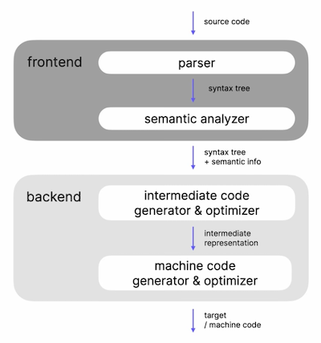
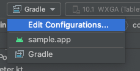
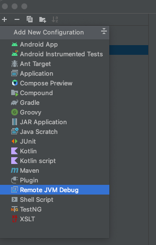
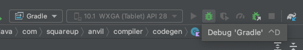

## Kotlin Compiler Plugin

Anvil is a Kotlin compiler plugin. While this document describes the internals of Anvil,
it assumes some prior knowledge of how to write a compiler plugin. Unfortunately, compiler
plugins are still experimental and there aren’t many resources available. These resources with
their sample projects, even though some are outdated, are helpful to get started:

* [The Road to the New Kotlin Compiler](https://www.youtube.com/watch?v=iTdJJq_LyoY)
* [Writing Your First Kotlin Compiler Plugin](https://twitter.com/KevinMost7/status/1050808104835829768?s=20&t=5yFTxnS-BnJdyiMqwlx2Nw)
* [Fixing serialization of Kotlin objects once and for all](https://medium.com/bumble-tech/fixing-serialization-of-kotlin-objects-once-and-for-all-95886fddba7a)
* [Writing Your Second Kotlin Compiler Plugin](https://bnorm.medium.com/writing-your-second-kotlin-compiler-plugin-part-1-project-setup-7b05c7d93f6c)

## Terminology

#### KAPT

KAPT is Kotlin’s annotation processing tool and allows using Java annotation processors for Kotlin.
Anvil generates code that the Dagger 2 annotation processor must see and the integration with KAPT
is crucial.

#### Compiler Frontend / Backend

The compiler is divided into two logical groups: a frontend and backend. The frontend is
responsible for building the syntax tree and semantic information. The backend is responsible for
generating platform specific code that can be consumed in this environment, e.g. for the JVM and
Android that's JVM bytecode. For more details please watch the first 7 minutes of
[The Road to the New Kotlin Compiler](https://www.youtube.com/watch?v=iTdJJq_LyoY).



#### Hint

Anvil generates “hints” for all contributed types. Hints make Anvil faster, because Anvil only
needs to search in the hint package to find all contributions.

#### `CodeGenerator`

A `CodeGenerator` is part of Anvil’s API and allows third parties to extend Anvil. Code generators
run in the compiler frontend and generate Kotlin code.

#### `ClassReference`

A `ClassReference` is an abstraction for the PSI and Descriptor APIs from the Kotlin compiler.
During different stages of compilation the compiler uses one or the other API. `ClassReference`
avoids different code branches and hides the necessary implementation details.

#### PSI

Program Structure Interface (PSI) is an abstract syntax tree used in the frontend of the compiler
to parse and represent source code.

#### Descriptors

Descriptors are used in the old compiler backend (and partially frontend) to represent resolved
types. After a type is resolved it doesn’t change anymore. A common use case is querying a type
from a dependency that isn’t part of the compilation. Instead of having access to the source code
(PSI) we rely on a descriptor. Descriptors themselves are an abstraction for Kotlin code,
Java code and bytecode.

#### IR

IR stands for intermediate representation of code structures. The compiler translates structures
like PSI from the frontend into IR. IR is used in the backend of the compiler (that's why you
often hear "IR backend"). In the backend the IR structures are transformed into the specific
platform code. For JVM projects that's JVM bytecode.

## Gradle Plugin

Like most compiler plugins Anvil comes with its own Gradle plugin handling all the ceremony to
set up the compiler plugin. The Gradle plugin gives you options to configure Anvil through
the `anvil { .. }` DSL, adds configurations to integrate custom code generators, e.g.

```groovy
dependencies {
  anvil project(':sample:code-generator')
  implementation project(':sample:annotation')
}
```

adds the Anvil `annotations` artifact to the compile classpath and applies several fixes and
workarounds to make the compiler plugin work, e.g. in incremental build scenarios:

* [KT-38576](https://youtrack.jetbrains.com/issue/KT-38576)

## KAPT Specifics

Anvil makes dependency injection for Dagger 2 easier. Dagger 2 is an annotation processor and
therefore Anvil must integrate with KAPT. The way KAPT works is that it adds two more Gradle tasks
to a Gradle module before the Kotlin compilation task runs. The flow is similar to this:

```
generate Java stubs → run annotation processor → run Kotlin compilation → run Java compilation
```

It’s important to note that the stub generating task is a Kotlin compilation task and in this
Gradle module Anvil runs twice: during stub generation and during Kotlin compilation. That’s
crucial, because Anvil needs to generate code before Dagger runs in the annotation processing task.

## Merging Contributions with Hints

Anvil allows you to contribute Dagger modules, bindings, component interfaces and subcomponents.
Shortly before Dagger is run we need to merge the contributions and provide Dagger with the
correct input generated by Anvil. Merging contributions is triggered by the `@Merge*` annotations.

To speed up the merging phase, we create a hint in a special `anvil.hint` package for every
contribution. During the merge phase we scan this special package to find all contributions and
then generate the expected code. Initially, Anvil didn’t use any hints and scanned the entire
compilation classpath instead. This worked and was a lot easier from an implementation point of
view, but it increased total build time by 20%. Using hints reduced the overhead to 2-4%.

A hint is a pointer to the class that is being contributed and implemented by a property.
For performance reasons and faster filtering without resolving all contributed types we
additionally create properties for the scopes. Note that Anvil annotations can be repeatable. We
only need one reference property to point to the contributed class, but we need multiple scope
properties for each contribution to a specific scope:

```kotlin
package anvil.hint.binding.com.squareup.anvil.test

val com_squareup_anvil_test_AppBinding_reference: KClass<AppBinding> = AppBinding::class

val com_squareup_anvil_test_AppBinding_scope_1: KClass<AppScope> = AppScope::class

val com_squareup_anvil_test_AppBinding_scope_2: KClass<AppScope> = OtherScope::class
```

With that hint we can query all top-level properties within the `anvil.hint.*` package. Our
class scanner is fast, because except for our hints no other code lives in the `anvil.hint`
package. Additionally, we don’t need to resolve the type `AppBinding` during compilation
(these operations can add up), if we look for a scope other than `AppScope`. In the property names
we encode the fully qualified name of the contributed type to avoid potential clashes. We
follow the same concept for all `@Contributes*` annotations.

If we wouldn’t have the generated hints, then our class scanner would need to scan the entire
compilation classpath, resolve all types and check if they’re annotated with one of our
annotations. That’s a very costly operation.

## Compiler Frontend and Backend

Not sure what this means? Checkout:
[The Road to the New Kotlin Compiler](https://www.youtube.com/watch?v=iTdJJq_LyoY).

Anvil leverages both the frontend and backend. We use the frontend to generate most of the code,
because the hooks the compiler provides are easier to use. The frontend is built on PSI,
an object oriented representation of source code (AST). Anvil generates Kotlin code itself and
through an `AnalysisHandlerExtension` we ask the compiler to restart compilation and include our
newly generated code. Besides allowing us to generate Kotlin code directly instead of generating
other data structures like IR, another advantage of leveraging the frontend is that the generated
code can be synced in the IDE for easier inspection and the code is easier to understand and
debug. All hints for Anvil are generated in the frontend. The compiler frontend only allows you
to generate new code and it’s not possible to modify any existing code (this will change with
the new K2 compiler).

The merging of contributions happens in the compiler backend, because Anvil needs to modify
existing code. A trigger to merge code looks like this:

```kotlin
@MergeComponent(Scope::class)
interface MyComponent
```

Anvil will find all contributions for this scope and then modify this interface. It’ll add a
separate `@Component` annotation from Dagger and include all Dagger modules. It’ll also add all
contributed component interfaces as super types to this interface. A result may look like this:

```kotlin
@MergeComponent(Scope::class)
@Component(modules = [ContributedModule::class])
interface MyComponent : ContributedComponentInterface
```

Since this code is only generated in the backend of the compiler, there’s no way to see the
generated source code. It’s only possible to inspect the generated bytecode from the
`.class` or `.jar` files in the build directory. A neat trick is to look at the generated Java
stubs in the `build/tmp/kapt3/stubs` folder, if KAPT is being used. Remember that the stub
generating task must generate Java code in order to feed annotation processors and the Java
source code contains generated annotations and super types.

Although Anvil uses Kotlin 1.6, the IR compiler backend became stable in Kotlin 1.5 and the
old backend was deprecated in Kotlin 1.6, we still must support the old backend, because the
stub generating task still uses the old backend no matter what. Since Anvil heavily relies on the
stub generating task, we had to implement the merging phase twice for different APIs. Jetbrains
promised a solution in Kotlin 1.7:

* [#422](https://github.com/square/anvil/issues/422)
* [KT-49682](https://youtrack.jetbrains.com/issue/KT-49682)

To ensure feature parity, compatibility and avoid regressions, we run all of our tests twice in
the old and new backend.

## Generating Code in the Frontend

`AnalysisHandlerExtension` doesn’t allow multiple rounds. It means, you can generate Kotlin code
once and not a second time. If you wish to generate more code based on the previously
generated code, then that’s not possible. Anvil requires multiple rounds and we implemented our
own abstraction for that.

We introduced the `CodeGenerator` interface, which allows you to generate code. It is being
called multiple times until no new code is generated. Our `CodeGenerationExtension`, which is
a `AnalysisHandlerExtension`, parses generated Kotlin code to PSI and then calls code generators
with the new code as input again.

The `CodeGenerator` interface was so generic, simple and convenient, that we opened it up to
third parties. Anyone can create an extension for Anvil by implementing this interface and adding
the dependency to Anvil’s classpath:

```groovy
dependencies {
  anvil project(':sample:code-generator')
}
```

Anvil will load all code generators through Java’s `ServiceLoader` API. Internally, all code
generation in the frontend within Anvil happens through `CodeGenerator` implementations,
e.g. generating hints.

`CodeGenerator`s operate in the frontend of the compiler. That means any changes happening
within the backend during the merge phase aren’t picked up by `CodeGenerator`s within the same
module.

## PSI, Descriptors, IR → ClassReference

The compiler uses different data structures during the different stages of compilation. In
the frontend it’s a mix of PSI and Descriptors (PSI is used for source files in this module,
Descriptors are used for types from precompiled dependencies that you need to resolve in the
frontend). In the old backend it’s Descriptors only. In the new IR backend the compiler uses
IR data structures. The unfortunate part for Anvil is that it has to implement the same
functionality up to three times, e.g. getting a scope for an annotation. In the beginning Anvil
was simpler and it was easy to branch the logic with if-else statements, but this became especially
problematic with code generation in the frontend through custom code generators. You have to
constantly switch between PSI and Descriptors.

`ClassReference` is an abstraction for all the compiler APIs and provides an API for commonly
shared functionality, e.g. get all annotations for a class or give me the scope of this annotation.
`ClassReference` was introduced way too late and a lot of code has to be migrated to use it.

In order to make `ClassReference` work, Anvil needs access to the compiler context. The compiler
gives us many details through the `ModuleDescriptor`, e.g. it allows us to resolve class
descriptors given an `FqName`. We wrap the original module descriptor in `AnvilModuleDescriptor`
to better keep track of generated code and improve certain operations like finding all classes
given a collection of `KtFile`.

We expose `ClassReference` and some of the functionality of `AnvilModuleDescriptor` through
the `compiler-utils` artifact. While it’s recommended to use this artifact to make implementing
custom code generators easier, we don’t guarantee any source or binary compatibility. APIs can
be added, changed or removed at any time. Therefore, we annotate all publicly available APIs
with `@ExperimentalAnvilApi`.

## Contributing Bindings / Subcomponents

Earlier it was mentioned that hints are generated in the frontend through code generators and
the merge phase is implemented in the backend. This is true for contributed modules and component
interfaces. The exceptions are contributed bindings and subcomponents.

We merge contributed bindings in a `CodeGenerator` in the frontend already, because the generated
code itself uses Anvil annotations and must be processed by other code generators. The code
generator for contributed bindings scans the classpath and finds all contributed bindings in
this module, and then generates one large Dagger module with all binding / provides methods for
these types. The `CodeGenerator` for contributed subcomponents works very similarly.

## Generate Dagger Factories

This feature is not required to make Anvil work, but it brings significant performance
improvements at build time. Anvil is a convenience tool and increases build times (more work
during compilation means longer build times). Generating Dagger factories flipped the coin.

As soon as you use one annotation with importance to Dagger, e.g. `@Inject` or `@Module`, then
you must enable the Dagger annotation processor and KAPT. KAPT is slow due to all the extra work
in the stub generating task, annotation processing itself and running javac (Dagger generates
Java code). The majority of generated code for these annotations is very simple and
straightforward.

If you opt-into
[Dagger Factory Generation](https://github.com/square/anvil#dagger-factory-generation), then you
can safely remove the Dagger annotation processor and likely KAPT as well. Anvil will process
the annotations Dagger cares about and generate necessary code. Not only does this skip the
stub generating task and annotation processing, but Anvil also generates Kotlin code and we don’t
need to run javac additionally (it becomes a no-op). That’s very efficient. Obviously, this
functionality is implemented through multiple `CodeGenerator`s.

There’s one exception and that’s `@Component`. If Dagger sees `@Component`, then the real magic
happens and Dagger generates code for the component and all subcomponents. It verifies that all
dependencies are provided and there are no duplicate bindings. We didn’t replicate that
functionality within Anvil (then we’d have our own DI framework and wouldn’t need Dagger anymore)
and these modules must still use KAPT and the Dagger annotation processor. Note that modules
using `@MergeComponent` must also enable KAPT. However, if you exclusively use subcomponents
in a module, then the Dagger annotation processor and KAPT aren’t required.

## Debugging Anvil

Anvil can be imported directly in the latest IntelliJ IDEA version (probably Android Studio too).
It’s very easy to write unit tests for Anvil and TDD often works: create a new test, write the
input source code, run the compiler in the test and verify the generated output. It’s
recommended to debug Anvil this way. E.g. if Anvil fails to parse a specific class, try to
isolate and replicate this error in a unit test.

If you need to debug in Anvil in another project, then you can easily do so in a few steps.
First, you need to prepare IntelliJ that synced the Anvil project to attach the debugger
(do this only once):

1. Open the Run configurations pane

   
2. Hit the Plus icon to create a new “Remote JVM Debug” configuration.

   
3. Change the name to anything you like and hit “OK”.

Kotlin compilation usually happens in its own daemon process. It’s recommended to debug Anvil not
in a daemon and in-process with Gradle:

1. Kill all Kotlin and Gradle daemons:
   ```
   > killall -9 java
   ```
2. Run your build:
   ```
   > ./gradlew :your:project:assemble --no-daemon -Dorg.gradle.debug=true -Dkotlin.compiler.execution.strategy=in-process
   ```
3. Gradle will wait to execute any task until you attach the debugger. Hit the debug button in
   IntelliJ:

   

   After that compilation will stop at any breakpoint within the Anvil project during compilation.

Pro Tip: Heavily use IntelliJ’s
[evaluate expression feature](https://www.jetbrains.com/help/idea/examining-suspended-program.html#inline-view)
with the debugger attached to inspect classes and run any arbitrary code.

If you try to view the source code or documentation of any compiler API, then you’ll be
disappointed, because the Kotlin compiler API artifacts come without any sources. IntelliJ will
try to decompile the bytecode, but that’s not convenient and makes debugging harder. It’s
recommended to download the specific compiler sources for the Kotlin version of the project
manually and attach them instead of using decompiled sources.

1. Sources are available here at the bottom:
   https://github.com/JetBrains/kotlin/releases/tag/v1.6.10 (change the version if necessary)
2. Unzip the file and use the extracted root directory to attach sources in IntelliJ.
